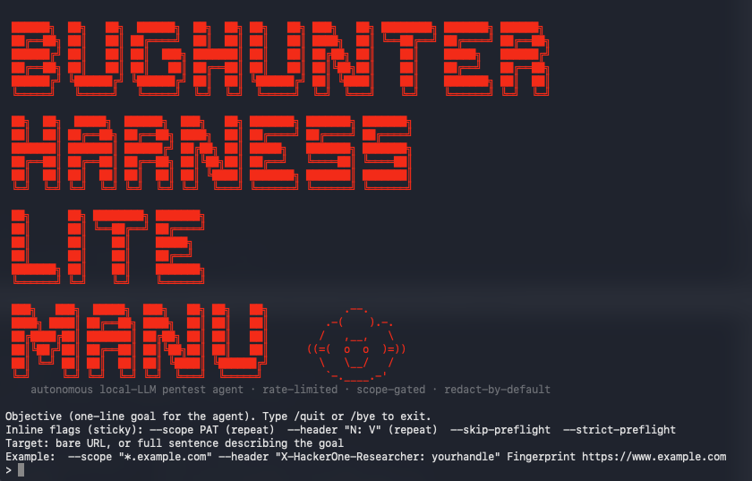

# bughunter-harness-lite



Mobile-first, single-process, agent-loop LLM pentest harness. Designed
to run inside a Termux + Kali NetHunter chroot on Android with **Ollama**
serving a small model (a 3B fine-tune fits an 8 GB phone comfortably),
and to give the operator a REPL that behaves the same way as the desktop
`bughunter-harness` — same scope allowlist, same rate limit, same secret
redaction, same session logging — with a much smaller toolbox and no
multi-agent orchestrator.

> **Sibling repo**: for the full desktop pipeline (multi-agent
> orchestrator, 13-stage recon → auth flow, adversarial-review gate,
> multi-host mode, WPScan + Shodan integrations, screenshot triage,
> typosquat OSINT), see **[marcodemm/bughunter-harness](https://github.com/marcodemm/bughunter-harness)**.
> `-lite` is intentionally a subset — same security guarantees, none of
> the heavy scanners.

---

## When to reach for `-lite` instead of the desktop harness

Use `-lite` on the phone (or on a laptop when you don't want a 40-turn
pipeline) for:

- Verifying a finding from a coffee shop without opening the laptop
  (`does this endpoint still 500 on that payload?`).
- Reacting to an OOB push notification with two turns of context.
- Fingerprinting a fresh subdomain in 30 s (subfinder + httpx +
  `nuclei -id <CVE>`).
- Chat-with-your-model UX to brainstorm payloads for a specific vector,
  without the model auto-executing agents.

Use the **desktop harness** for a bounded but broad automated pass on a
scope you have just been given (subs → live → tech → content → login →
web-vuln → wordpress → api-fuzz → auth → report → adversarial review).

If you find yourself wanting `-lite` to grow a `multi-host` mode or an
`adversarial-review` stage, that is the signal to run the desktop harness
instead.

---

## What's in the toolbox

Every tool call goes through the same gates as the desktop harness:
**scope allowlist → rate limit → (for shell) binary allowlist + flag
denylist → execute → secret redact → return**. None of these live in
the prompt; the model cannot bypass them by asking nicely.

| Tool | What it does | Notes |
|---|---|---|
| `http_get(url, headers?)` | GET with attribution headers | Any HTTP status ≥ 200 is returned as-is (headers + body, both truncated + redacted). |
| `http_post(url, body, content_type?)` | POST with attribution headers | Body is a string; JSON must be pre-serialized. |
| `run_shell(command)` | Run one allowlisted CLI | First token must be one of `curl dig host whois httpx subfinder gau waybackurls nuclei ffuf wpscan`. Denylist blocks pipes, redirects, `sudo`, `rm`, destructive HTTP verbs. `nuclei` requires `-id <template>` (no `-tags cve` bulk runs). |
| `oob_generate_token(purpose)` | Return a fresh OOB URL under your catcher host | The catcher host is `oob.host` in `config.yaml` — set it to YOUR OWN infrastructure, never a third-party service. |
| `finish(summary)` | Stop the run cleanly | Ends the current one-shot. In REPL, the next `>` line starts a fresh session so `finish()` doesn't block subsequent objectives. |

**Explicitly not included** (and won't be — that's the whole point of
`-lite`): `katana` (JS crawl too heavy on ARM chroot), `gowitness`
(Chrome headless), `sqlmap` (multi-minute runs), `dalfox`, `nikto`,
`masscan` / `nmap -sS` (need raw sockets — do not work in a chroot).
Reach for the desktop harness for those.

---

## Install

```bash
git clone https://github.com/marcodemm/bughunter-harness-lite.git
cd bughunter-harness-lite
python3 -m venv .venv
source .venv/bin/activate
pip install -r requirements.txt

cp config.example.yaml config.yaml
cp scope.example.txt   scope.txt
# Edit both — the ones you cloned are just samples.
```

### On Android (Termux + Kali NetHunter chroot)

```bash
# From the chroot (`nh`), one time:
apt update && apt install -y python3 python3-venv git curl dnsutils whois
# Then the same clone + venv + pip flow as above.
```

Recommended CLI tools inside the chroot (install what you actually plan
to use — none are hard requirements):

```bash
# In the chroot:
apt install -y whois dnsutils            # dig, host, whois — small, always useful
# Bigger tools; pick per need:
apt install -y httpx-toolkit             # `httpx` (probe)
# subfinder / gau / waybackurls / nuclei / ffuf / wpscan are Go/Ruby
# binaries — install via `go install` or their release tarballs.
```

## LLM backend

`llm.servertype: auto` probes local endpoints in this order and uses the
first that answers:

1. Ollama on `127.0.0.1:11434` (mobile default — recommended).
2. LM Studio on `127.0.0.1:1234`.
3. Llama.cpp `llama-server` on `127.0.0.1:8080`.

For cloud (OpenAI / Anthropic / Google Gemini / NVIDIA NIM), set
`llm.servertype` explicitly and either put `llm.api_key` in the config
or set `llm.api_key_env` to the env var name.

**⭐ Recommended model — `Qwen2.5-VL-3B-uncensored-bughunter-v9`**
([mmp2055/Qwen2.5-VL-3B-uncensored-bughunter-v9 on Hugging Face](https://huggingface.co/mmp2055/Qwen2.5-VL-3B-uncensored-bughunter-v9)).
A Qwen 2.5 VL 3B fine-tune trained specifically for mobile bug-bounty
workflows: same behaviour focus as the desktop harness'
[Qwen3.5-35B-A3B-uncensored-bughunter-v8](https://huggingface.co/mmp2055/Qwen3.5-35B-A3B-uncensored-bughunter-v8)
(concrete tool calls over hand-wavy prose, knows nuclei / httpx /
subfinder / wpscan / ffuf / gau flags without hand-holding, doesn't
refuse lab-only default-cred probes on DVWA / Juice Shop / Mutillidae)
but sized for an 8 GB phone. Fits comfortably inside a Termux + Kali
NetHunter chroot with Ollama. The default `llm.model` in
[`config.example.yaml`](config.example.yaml) is pinned to `bughunter-v9`
so it works out of the box once you import the GGUF into Ollama;
substitute your own model if you prefer.

Any other 3B–7B fine-tune with function-calling support will also
work — just point `llm.model` at the id your backend serves.

Tips for Ollama on Android:

- Write a `Modelfile` that pins `PARAMETER temperature 0.1`,
  `PARAMETER num_ctx 8192` (safe on 8 GB), a ChatML `TEMPLATE`, and a
  short `SYSTEM` about "you are a bug-bounty assistant". Small model
  defaults are otherwise too random for tool calling.
- `ollama serve` in one Termux tab, this harness in another. Keep both
  in `tmux` so `Ctrl+Z` back to the launcher doesn't kill them.

---

## Run

### One-shot

```bash
python harness_lite.py \
  --objective "Fingerprint https://example.com and report the tech stack" \
  --scope example.com
```

The run stops when the model calls `finish()`, or when it hits
`limits.max_iterations` / `limits.max_wall_time_sec`, or on `Ctrl+C`.
Everything is logged to `sessions/YYYYMMDDTHHMMSSZ.jsonl` (one line
per event: LLM reply, tool call, tool result, kill switch, finish).

### REPL

```bash
python harness_lite.py --scope example.com
```

Same UX as the desktop `bughunter-harness`: the harness prints the red
banner + `HELP_TEXT` and drops into a `>` prompt. **Each line you enter
is a fresh one-shot** with that objective (a new session log, a fresh
LLM conversation) — not a rolling chat.

> **Note — the `>` prompt is NOT a shell.** Anything you type that
> isn't a slash command (`/quit`, `/help`, `/run …`) or a sticky-flag
> line (`--scope …`, `--header …`) is sent to the backend LLM as a
> fresh objective. The model then decides what tool calls to make
> against the target (constrained by the security gates below).
>
> **Example — ask the agent in natural language:**
>
> ```
> > run wpscan against https://example.com with --enumerate vp -t 5 --disable-tls-checks --request-timeout 20 --connect-timeout 10 and report the plugins found
> ```
>
> The LLM will (with luck) tool-call `run_shell({"command": "wpscan --url https://example.com ..."})` on its own turn. **The model may edit your command** (add/remove flags, tweak the URL), and it costs at least 2 LLM turns (one to decide the tool call, one to `finish()` with a summary). If you want the command executed **verbatim**, no model in the loop, use `/run` instead — see the slash-commands section below.

Sticky flags carry across sessions in the same REPL. Set them once,
they stay until you clear them with an empty value:

```
> --scope "*.example.com" --header "X-HackerOne-Researcher: yourhandle"
[+] scope set (sticky): ['*.example.com']
[+] header set (sticky): X-HackerOne-Researcher: yourhandle

> Fingerprint https://www.example.com
[+] Pre-flight: ALIVE · HTTP 200 from https://www.example.com
[tool] http_get({"url": "https://www.example.com"})
…
[finish] Nginx 1.24 + WordPress 6.7.1 + Elementor Pro 3.20.0

> https://api.example.com/v1/users
─── Previous session ended ───
New objective (or /quit / /bye to exit).
```

Slash commands:

```
/quit  /bye  /exit           leave the harness (or: quit / bye / exit)
/help                        print HELP_TEXT again
/run <shell command>         run one allowlisted shell command DIRECTLY,
                             bypassing the LLM. Aliases: /sh, /shell.
Ctrl+C                       cancel current session and exit
```

`/run` (and its aliases `/sh` / `/shell`) executes ONE allowlisted shell
command verbatim, without spending an LLM turn on it. Every security
gate still applies: shell allowlist (`curl dig host whois httpx
subfinder gau waybackurls nuclei ffuf wpscan`), the denylist for pipes /
redirects / sudo / etc., the scope check (with the `scope_enforcement`
policy — strict / warn / off), the rate limit, the secret redactor, the
ANSI-strip and the `shell_timeout_sec` cap. Each `/run` creates its own
session folder just like a normal REPL objective, so the output ends up
in a fresh `sessions/<UTC>/session.jsonl` + `REPORT.md` pair.

Example — dispatch a deep `wpscan` on demand without spending LLM turns
on the tool-call decision:

```
> --scope www.example.com
> https://www.example.com                              # auto-recon (< 60s)
[…finish + REPORT.md…]

> /run wpscan --url https://www.example.com --enumerate vp -t 5 --disable-tls-checks --request-timeout 20 --connect-timeout 10
[shell] wpscan --url https://www.example.com --enumerate vp -t 5 …
  ⠋ run_shell · wpscan --url https://www.example.com --enumerate v… · 47s / 600s
[result] [exit=0] Interesting Finding(s): …
[report] sessions/YYYYMMDDTHHMMSSZ/REPORT.md
```

Compare with the indirect route (typing the same intent in natural
language): the LLM sees the objective, tool-calls `run_shell` with
whatever command it thinks best (possibly editing yours), then likely
calls `finish()` with its own summary — 2+ LLM turns and no guarantee
the command runs verbatim. `/run` skips all of that.

Sticky flags accepted inline in the prompt:

```
--scope PAT (repeatable)         in-scope allowlist
--header "NAME: VALUE" (repeat)  custom HTTP header
--skip-preflight                 skip probe for this session
--strict-preflight               abort on probe failure
--max-iterations N               override iter cap
--max-wall-time-sec N            override wall-time cap
--servertype S  --model M  --base-url URL       LLM backend overrides
```

Pass an empty value to clear a sticky: `--scope ""` · `--header ""`.

A bare URL is treated as a recon objective (e.g. `https://www.example.com`
becomes "Recon https://www.example.com — fingerprint tech and note
anything obvious.").

## Pre-flight target reachability

Before the agent loop (in one-shot mode with a URL objective) the
harness runs one HTTP probe against the target. Same shape as the
desktop harness — three modes controlled by `preflight.strict`:

- **skip** — `--skip-preflight` — no probe, useful for VPN/allowlist
  targets that always fail a plain probe by design.
- **soft (default)** — probe; on failure WARN and continue. A WAF that
  drops the python-requests handshake can still accept later tool
  requests with different headers.
- **strict** — `strict: true` in config or `--strict-preflight` — abort
  on any probe failure.

Even in soft mode, the run aborts on markers that never recover no
matter how many tools you throw at them:

- Invalid input: `InvalidURL`, `No host supplied`, `MissingSchema`,
  `InvalidSchema`, `empty target`.
- Network dead: `NXDOMAIN`, `Name or service not known`,
  `getaddrinfo failed`, `Temporary failure in name resolution`,
  `Connection refused`, `No route to host`, `Network is unreachable`.

`ConnectTimeout` stays soft on purpose — a WAF drop is often just a UA
fingerprint issue.

## Session limits (kill switches)

- `limits.max_iterations` — one-shot cap (default 20).
- `limits.max_iterations_per_repl_turn` — legacy field, currently
  ignored: each REPL objective spawns a fresh one-shot session that
  uses `max_iterations` directly (same behavior as the desktop harness
  REPL). Kept in the sample config only to document the historical
  chat-style REPL that was removed in favor of one-shot-per-line.
- `limits.max_wall_time_sec` — wall-clock cap (default 900 s / 15 min).
- `limits.shell_timeout_sec` — per-command cap for `run_shell` (60 s).
- `limits.http_timeout_sec` — per-request cap for `http_get` /
  `http_post` (20 s).

**`Ctrl+C`** at any point closes the session cleanly (a `sigint` event
is written to the JSONL) and exits with code 130.

## Security model

- The scope allowlist is checked in code on every `http_get` /
  `http_post` (target host) and on `run_shell` (first URL-looking arg,
  or first positional bare-host arg — belt for tools like
  `subfinder -d`). Enforcement is controlled by
  `config.yaml` → `scope_enforcement`:
    - `strict` (default in `config.example.yaml`) — out-of-scope host =
      ERROR, tool refuses.
    - `warn` (default in the desktop `bughunter-harness`) — out-of-scope
      host = `[WARN …]` prefix on the result, tool RUNS anyway. Handy
      for lab / dev where you want `subfinder -d example.com` even
      though only `www.example.com` is in scope.
    - `off` — no gate. Tests only.
- The rate limiter is global and enforced with a `threading.Lock`.
- The shell binary allowlist is short on purpose. Every addition is an
  audit item. `nuclei` is gated on `-id <template>` because bulk template
  runs make no sense from a phone.
- Redaction (`redact.py`) strips JWTs, AWS keys, Google API keys,
  Stripe/GitHub/Slack tokens, PEM blocks, `Set-Cookie` values,
  `Authorization` headers, SSNs, credit-card-looking sequences, and the
  local part of email addresses **before** the model sees the tool
  result or the session log persists it.
- Attribution headers (`X-Bug-Bounty-Researcher: <handle>`, or a
  program-specific header) are auto-added to every HTTP tool request so
  the target's SOC can identify the source and correlate.

Same rules as the desktop harness. If any of them is a problem for your
scope (e.g. a program bans automated recon entirely), do not run this
harness there — read the program policy first.

## Sessions

Each one-shot session gets its own folder under `sessions/`, matching
the desktop `bughunter-harness` layout. In REPL mode, where every
accepted line spawns a fresh session, each objective produces its own
folder:

```
sessions/
├── 20260911T180000Z/
│   ├── session.jsonl          ← raw event log
│   └── REPORT.md              ← Markdown report
└── 20260911T181245Z/          ← next REPL objective
    ├── session.jsonl
    └── REPORT.md
```

`session.jsonl` is one JSON object per line, in order:

- `meta`      — objective, backend, model, scope snapshot, config caps.
- `llm_reply` — assistant content + tool_calls.
- `tool_call` — name + args (JSON), one per call.
- `tool_result` — string returned by the tool (already redacted).
- `kill`     — kill switch fired (max iters, max wall, LLM error).
- `sigint`   — `Ctrl+C` pressed.
- `finish`   — `finish()` called by the model.
- `end`      — iterations executed + total elapsed seconds.

Useful to review what the agent did, reproduce a hit, or hand context
to the desktop harness for a full run.

### REPORT.md (Markdown session report)

`REPORT.md` sits next to `session.jsonl` in the same folder, written by
[`report.py`](report.py) after the run finishes.

The report contains:

- **Header** — session log filename, objective, backend + model, base URL,
  scope (hosts / wildcards / networks), OOB host + prefix, start / end
  timestamps, elapsed wall time, iterations, tool-call count, outcome
  (`finish` / `kill` / `sigint` / `incomplete`).
- **Tool calls (timeline)** — one Markdown table row per call: index,
  tool name, args (truncated), result (first 120 chars, redacted).
- **Assistant narrative** — any free-text the LLM produced between tool
  calls (empty when the model spoke only through tool calls, which is
  common with small models).
- **Findings** — the `finish()` summary if the session ended cleanly;
  otherwise the kill reason or "session interrupted with Ctrl+C".
- **Footer** — pointer back to the JSONL and its event count.

**Skip the report per run**: pass `--no-report` on the CLI, or as a
sticky flag in the REPL — for that REPL, subsequent sessions do not
write REPORT.md until you clear it (there is no "un-set" today; restart
the REPL to reset the sticky).

```bash
# one-shot without report
python harness_lite.py --no-report --scope example.com --objective "..."

# REPL: set the sticky once, no reports for the rest of the REPL
python harness_lite.py --scope example.com
> --no-report
[+] no_report = True (sticky) — REPORT.md will NOT be written.
> Fingerprint https://www.example.com
```

The JSONL is always written — `--no-report` only skips the Markdown
render step; the raw log stays available for later analysis or for
piping into the desktop harness.

## License

MIT — see [LICENSE](LICENSE).

## Related

- **Desktop pipeline**: [marcodemm/bughunter-harness](https://github.com/marcodemm/bughunter-harness) — multi-agent orchestrator, 13 stages, adversarial review, multi-host mode.
